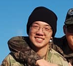

# Introduction

Hi, my name is Jimin, and I am a computer science major at UCSD.

My Life Quote:
> You take the blue pill - the story ends, you wake up in your bed and believe whatever you want to believe. You take the red pill - you stay in Wonderland and I show you how deep the rabbit-hole goes.

***This quote from the matrix gives me the courage to face my troubles***

~~UCSD makes me want to choose the blue pill..~~

## Short Fun Fact

The command `ls` is actually short for list! 

You can read more about it here: 
[History of ls](https://en.wikipedia.org/wiki/Ls#:~:text=An%20ls%20utility%20appeared%20in,and%20the%20Single%20Unix%20Specification.)

## Relative Link Test

Click [here](relativeLink)

## My Current Courses

- CSE105
- CSE110
- COGS108
- EDS124

## My Favorite Foods Ranked

1. Fried Chicken
2. Pizza
3. Sushi
4. KBBQ 

## Stocks to Watch

- EV
  - Tesla
  - Nio
  - FRSX
- Genomics 
  - BNGO
  
## Things to do

- [ ] Fancy this website
- [ ] Have a life
- [x] Have a "oof" moment
- [x] Enjoy not having morning PT
- [ ] Watch lecture

Click [here](#introduction) to go back to the top.

